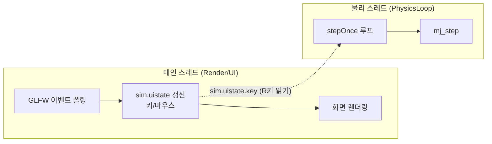
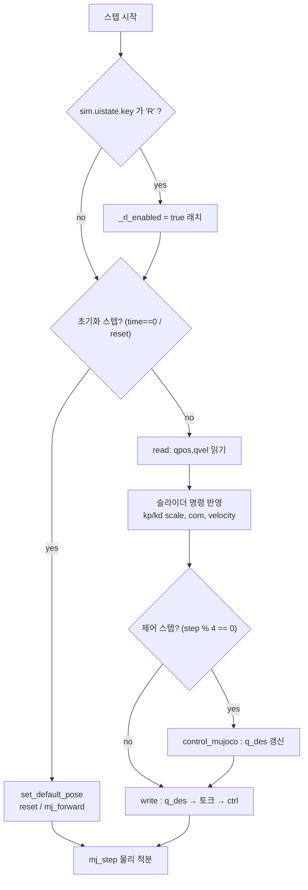
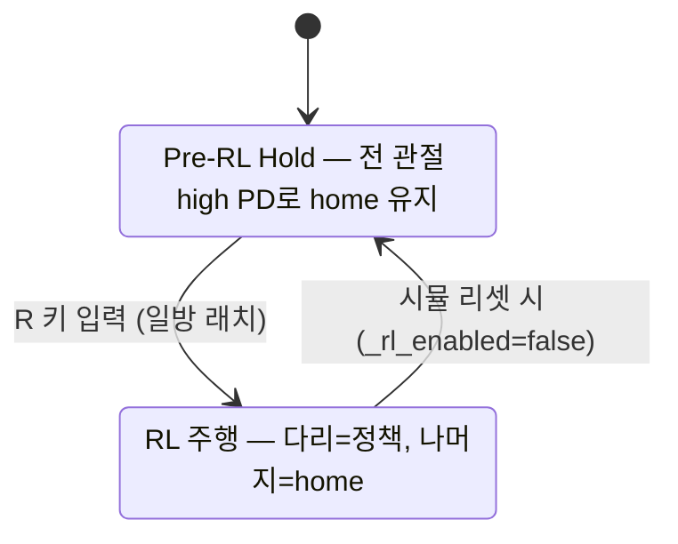
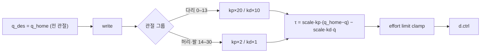
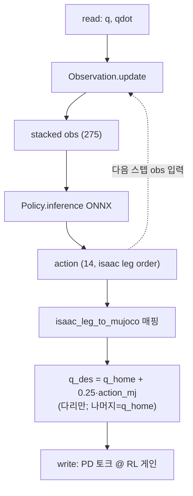
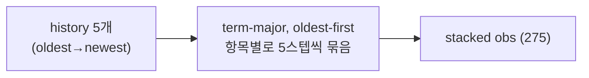
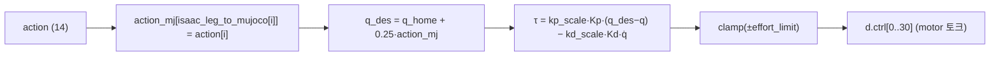
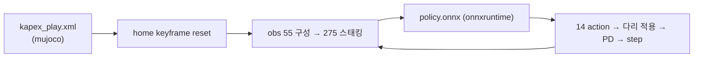

# KAPEX Sim2Sim 작동 파이프라인 (MuJoCo Deployment)

> 목적: 현재까지 구현된 MuJoCo 배포 코드의 **작동 흐름(파이프라인)** 정리.
> 라인 단위 코드 설명이 아니라 **데이터 흐름 · 제어 흐름 · 타이밍 · 전환 조건** 중심.
> 대상 실행 파일: `run` (KAPEX). *(G1 파이프라인 `run_g1`은 별개)*

---

## 0. 시스템 개요

- Isaac Lab(PhysX)에서 학습한 **하체 14-DOF leg-only RL 정책**을 MuJoCo에서 재생(sim-to-sim)한다.
- 로봇: **KAPEX 31-DOF** humanoid (다리 14 + 허리 3 + 양팔 14).
- 정책: ONNX. **입력 275** (leg-only 관측 55 × history 5), **출력 14** (다리 관절 목표).
- 두 가지 운전 모드로 나뉜다.

| 모드 | 조건 | 다리(0–13) | 허리·팔(14–30) |
|---|---|---|---|
| **A. Pre-RL Hold** | `R` 누르기 전 | high PD로 home 유지 | high PD로 home 유지 |
| **B. RL 주행** | `R` 누른 후 (latch) | **RL 정책**으로 제어 | RL 게인으로 home 유지 |

---

## 1. 실행 스레드 구조

- **UI 스레드**가 키 입력을 `sim.uistate`에 채우고, **물리 스레드**가 그 값을 폴링해 `R` 키를 감지한다(벤더 코드 미수정).

### 타이밍

| 주기 | 값 | 수행 항목 |
|---|---|---|
| 물리 스텝 | **5 ms (200 Hz)** | `write()` (토크 갱신) → `mj_step` |
| 제어/정책 | **20 ms (50 Hz)** | `control_mujoco()` (decimation = 4) |

→ 토크(PD)는 매 물리 스텝(200Hz) 갱신, 목표각 `q_des`는 50Hz로 갱신.

---

## 2. Per-step 시퀀스 (물리 스레드 `stepOnce`)

- `control_mujoco`(목표각 산출)는 50Hz, `write`(토크 산출)는 200Hz로 분리되어 있다.

---

## 3. 모드 게이팅 (`R` 키 상태 전이)

- `R`은 **일방 래치**: 한 번 누르면 RL 시작, 유지. 리셋 시에만 HOLD로 복귀.

---

## 4. Pre-RL Hold 파이프라인 (모드 A)

### 그룹별 게인 근거 (headless 검증)

| 그룹 | 스케일 | 이유 |
|---|---|---|
| 다리 | kp ×20 / kd ×10 | 낮으면(×3) 발목 처짐→전방 낙상. 정적 기립 임계 강성 ~×18↑ |
| 허리·팔 | kp ×2 / kd ×1 | 가벼워서 ×20이면 진동(흔들림). ×2에서 조용+처짐 작음 |

---

## 5. RL 주행 파이프라인 (모드 B, `R` 이후 50Hz)

- 정책 출력은 **다리 14개에만** 반영되고, 허리·팔은 `q_des=q_home`으로 유지된다.
- `write()`의 게인 스케일은 이 모드에서 슬라이더 값(기본 ×1 = 학습 게인)을 쓴다.

---

## 6. Observation 파이프라인

### 6-1. 단일 관측 (single obs = 55)

| 순서 | 항목 | dim | scale | 비고 |
|---|---|---|---|---|
| 1 | base_ang_vel | 3 | ×0.2 | `qvel[3:6]` raw (body-local) |
| 2 | projected_gravity | 3 | – | `[0,0,-1]`을 body frame으로 회전 |
| 3 | velocity_commands | 3 | – | 슬라이더 명령 (vx,vy,wz) |
| 4 | joint_pos_rel (다리) | 14 | – | `q − q_home`, isaac leg 순서 |
| 5 | joint_vel_rel (다리) | 14 | ×0.05 | isaac leg 순서 |
| 6 | last_action | 14 | – | 직전 정책 출력 |
| 7 | gait_phase | 4 | – | `[sin,cos](φ_L,φ_R)`, **`|vel_cmd|>0.1`일 때만 활성** |

- **gait_phase**: `phase = fmod(t, 0.8)/0.8`, `φ_R = phase+0.5`, `t = mj_time`. 명령이 없으면(정지) 4개 모두 0.

### 6-2. History 스태킹 (55 → 275)

- 정책과 반드시 일치해야 하는 규칙: **term-major + oldest-first**.
  (headless 실험에서 이 순서만 기립, newest-first/time-major는 발산)

---

## 7. Action → Torque 파이프라인

- **Residual 방식**: 정책 출력은 home 기준 증분(×0.25).
- MuJoCo actuator는 **motor(토크)** 타입이며 `ctrlrange`는 effort limit과 동일.
- Kp/Kd는 `kapex.py` 학습 게인(`joint_kp/kd[31]`).

---

## 8. 명령 입력 채널 (`d.ctrl[31..38]` = GUI 슬라이더)

| 채널 | 의미 |
|---|---|
| ctrl[31,32,33] | COM 명령 (dx,dy,dz) |
| ctrl[34] | kp_scale − 1 (RL 모드 게인 배율) |
| ctrl[35] | kd_scale − 1 |
| ctrl[36,37,38] | 속도 명령 (vx, vy, wz) → obs & gait 게이팅 |

---

## 9. DOF / Joint 매핑

| MuJoCo idx | 관절 | 그룹 | RL 제어? |
|---|---|---|---|
| 0–6 | LLJ1–7 (좌다리) | 다리 | ✅ |
| 7–13 | RLJ1–7 (우다리) | 다리 | ✅ |
| 14–16 | WLJ1–3 (허리) | 상체 | ❌ home 유지 |
| 17–23 | LAJ1–7 (좌팔) | 상체 | ❌ home 유지 |
| 24–30 | RAJ1–7 (우팔) | 상체 | ❌ home 유지 |

- Isaac(BFS 인터리브 L/R)과 MuJoCo 순서가 달라 매핑 테이블 필수:
  - `isaac_leg_to_mujoco[14]` — 정책 14출력/다리 obs용
  - `isaac_joint_to_mujoco[31]` — 전체 관절용

---

## 10. 주요 튜닝 포인트 / 상수

| 상수 (위치) | 값 | 역할 |
|---|---|---|
| `PRERL_LEG_KP/KD_SCALE` (controller.cpp) | 20 / 10 | Pre-RL 다리 강성 |
| `PRERL_UP_KP/KD_SCALE` (controller.cpp) | 2 / 1 | Pre-RL 상체 강성 |
| action scale (controller.cpp) | 0.25 | residual 크기 |
| 제어 주기 | 20 ms (decimation 4) | 정책 호출 |
| gait period (observation.cpp) | 0.8 s | gait_phase 주기 |
| `SINGLE_DIM / STACKED_DIM` (observation.h) | 55 / 275 | obs 차원 |

---

## 11. 검증 파이프라인 (headless close-loop)

- 환경: `hsmujoco` (mujoco + onnxruntime). GUI 없이 정책을 실제로 돌려 obs 계약/거동 검증.
- 검증 결과: **standing 6s 유지 / 전진 명령 시 +1.5m 이상 / 선회 정상.**
- 용도: 정책 교체·obs 변경 시 GUI 없이 빠르게 회귀 검증.

---

## 12. 미결 / 후속 항목

| 항목 | 상태 |
|---|---|
| Pre-RL 대기 중 **yaw 서서히 회전** | 원인 규명(floor `condim=3`, 발 torsional friction 없음). 수정 방식(xml 영구 vs 런타임 토글) **결정 대기** |
| RL 진입 순간 게인 급변(hard switch) | 의도된 동작(램프 미적용) |
| Isaac 재학습(다른 에이전트) | 진행 중 — obs/action 계약 변경 시 이 문서·매핑 갱신 필요 |
